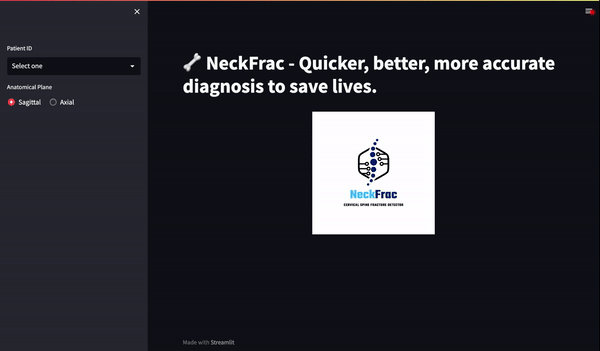
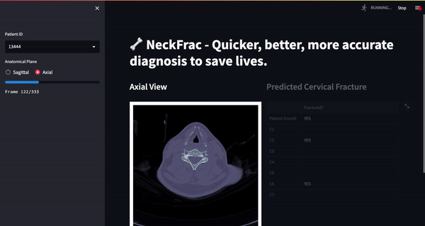

# NeckFrac Streamlit App

## Objective
Demonstrate how a model to detect cervical fracture can be used in conjunction with existing CT scans.

## Product Demos

Features:
- Select patient
- View sagittal and axial scans
- View cervical fracture model predictions on each vertebra

- View bounding boxes around the fracture within the axial view
